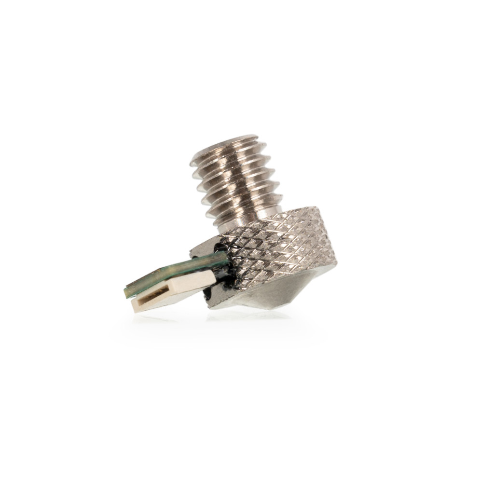

# Unicorn Chasing Kit
The Unicorn Chasing Kit is a resonance compensation toolkit centred around two core components: the Rethonance Nozzle, a V6-compatible nozzle with a built-in ADXL345 accelerometer and the Rethonance Hub, a magnetic, bed-mountable board that consolidates connectivity for ADXL sensors, motor thermistors, and a GPIO expansion port — all over a single USB connection. Together, they provide a convenient way for users to precisely measure resonance at where it actually matters - the nozzle.

## Rethonance Nozzle
  

The Rethonance Nozzle was designed by Cyd0nian and Reth as one of the only known true nozzle-integrated ADXL solutions available (alongside the E3D Revo Rethonance Nozzle). The concept is straightforward: rather than relying on a separate ADXL board, the sensor is embedded directly into the nozzle itself. Developed in collaboration with LDO, the Rethonance Nozzle serves as the foundation of The *Unicorn Chasing Club*.

The Rethonance Nozzle is a V6-style nozzle with a built-in ADXL345 accelerometer, featuring a non-ZIF (press-in) FFC connector. A thermistor is integrated into the nozzle which, in conjunction with the recommended Klipper configuration, protects the ADXL chip from overheating. The nozzle is compatible with any hotend that accepts V6-style nozzles.  

## Rethonance Hub  

The Rethonance Hub was developed to address a common inconvenience: the need to physically reposition a printer in order to connect an ADXL board. The solution is a dedicated board with a long USB cable and a magnetic mount, allowing it to be attached directly to the print bed for easy access.  

The Rethonance Hub features two press-in FFC connectors, both pin-compatible with either the LDO Rethonance Nozzle or E3D Revo Rethonance Nozzle. Additional features include four thermistor inputs — useful for monitoring motor temperatures on high-end AWD setups — as well as a third SPI port and a GPIO header for expanded connectivity and customization.

## Kit Contents
- Rethonance Nozzle
- Rethonance Hub
- 1.5m USB A to USB C cable
- 0.4m FFC Cable
- 6x3mm Magnets x3

